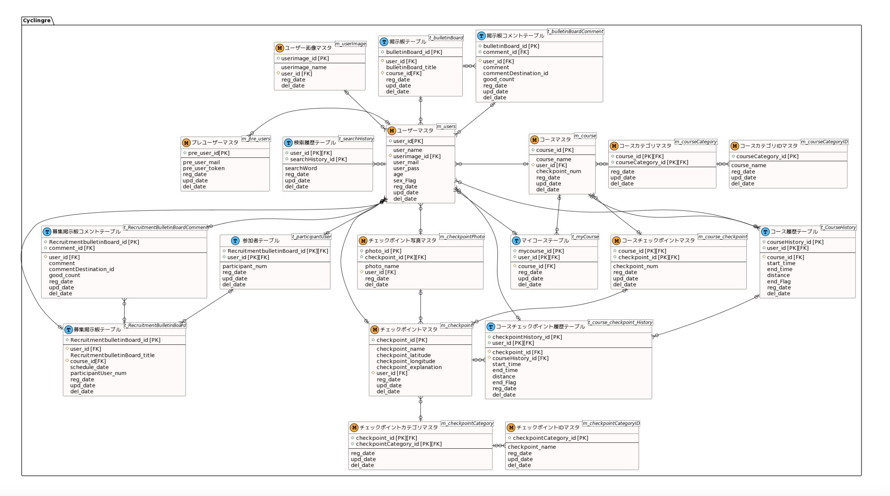

# DB定義書
## ER図
[ER図はこちら](https://github.com/AsoSD3A3/CyclingSystem/blob/main/DB/ER%E5%9B%B3.md)

*****

*****

# データベース設計図

## m_users

|和名|属性名(カラム名)|型|PK|NN|FK|
|---|-----|--|--|--|--|
|ユーザーID|user_id|varchar(50)|○|○||
|ユーザー名|user_name|varchar(100)||○||
|ユーザー画像ファイル名|user_image|varchar(200)||||
|メールアドレス|user_mail|varchar(100)||○||
|パスワード|user_pass|varchar(50)||○||
|年代|age|int(2)||○||
|性別フラグ|sex_Flag|int(2)||○||
|登録日|reg_date|datetime||○||
|更新日|upd_date|datetime||||
|削除日|del_date|datetime||||

## m_pre_users

|和名|属性名(カラム名)|型|PK|NN|FK|
|---|-----|--|--|--|--|
|ユーザーID|pre_user_id|int(8)|○|○||
|メールアドレス|pre_user_mail|varchar(100)||○||
|トークン|pre_user_token|varchar(50)||○||
|登録日|reg_date|datetime||○||
|更新日|upd_date|datetime||||
|削除日|del_date|datetime||||
|フラグ|flag|int(1)||○||

## m_courseID

|和名|属性名(カラム名)|型|PK|NN|FK|
|---|-----|--|--|--|--|
|コースID|course_id|int(8)|○|○||
|コース名|course_name|varchar(100)||○||
|ユーザー(作成者)ID|user_id|int(8)||○||
|チェックポイント数|checkpoint_num|int(8)||○||
|登録日|reg_date|datetime||○||
|更新日|upd_date|datetime||||
|削除日|del_date|datetime||||

## m_checkpointID

|和名|属性名(カラム名)|型|PK|NN|FK|
|---|-----|--|--|--|--|
|チェックポイントID|checkpoint_id|int(8)|○|○||
|チェックポイント名|checkpoint_name|varchar(100)||○||
|チェックポイント緯度|checkpoint_latitude|varchar(100)||○||
|チェックポイント経度|checkpoint_longitude|varchar(100)||○||
|チェックポイント説明説明|shop_explanation|varchar(1000)||||
|登録日|reg_date|datetime||○||
|更新日|upd_date|datetime||||
|削除日|del_date|datetime||||

## m_course_checkpoint

|和名|属性名(カラム名)|型|PK|NN|FK|
|---|-----|--|--|--|--|
|コースID|course_id|int(8)|○|○||
|チェックポイントID|checkpoint_id|int(8)|○|○||
|ユーザー(作成者)ID|user_id|int(8)||○||
|チェックポイント数|checkpoint_num|int(8)||○||
|登録日|reg_date|datetime||○||
|更新日|upd_date|datetime||||
|削除日|del_date|datetime||||

## t_CyclingHistory

|和名|属性名(カラム名)|型|PK|NN|FK|
|---|-----|--|--|--|--|
|サイクリング履歴ID|cyclingHistory_id|int(8)|○|○||
|ユーザーID|user_id|varchar(50)|○|○||
|コースID|course_id|int(8)||○|○|
|経過時間|time|time||○|○|
|距離|distance|int(255)||○|○|
|登録日|reg_date|datetime||○||
|削除日|del_date|datetime||||

## t_mycourse

|和名|属性名(カラム名)|型|PK|NN|FK|
|---|-----|--|--|--|--|
|マイコースID|mycourse_id|int(8)|○|○||
|ユーザーID|user_id|varchar(50)|○|○||
|コースID|course_id|int(8)||○|○|
|登録日|reg_date|datetime||○||
|更新日|upd_date|datetime||||
|削除日|del_date|datetime||||

## t_bulletinBoard

|和名|属性名(カラム名)|型|PK|NN|FK|
|---|-----|--|--|--|--|
|掲示板ID|bulletinBoard_id|int(12)|○|○||
|ユーザーID|user_id|int(12)||○|○|
|掲示板タイトル|bulletinBoard_title|varchar(200)||○||
|登録日|reg_date|date||○||
|更新日|upd_date|date||||
|削除日|del_date|date||||

## t_bulletinBoardComment

|和名|属性名(カラム名)|型|PK|NN|FK|
|---|-----|--|--|--|--|
|掲示板ID|bulletinBoard_id|int(12)|○|○|○|
|コメントID|comment_id|int(12)|○|○|○|
|ユーザーID|user_id|int(12)||○|○|
|コメント|comment|varchar(200)||○||
|コメント先ID|commentDestination_id|int(12)||||
|いいね(参考になった)|good_count|int(12)||○||
|登録日|reg_date|date||○||
|更新日|upd_date|date||||
|削除日|del_date|date||||

