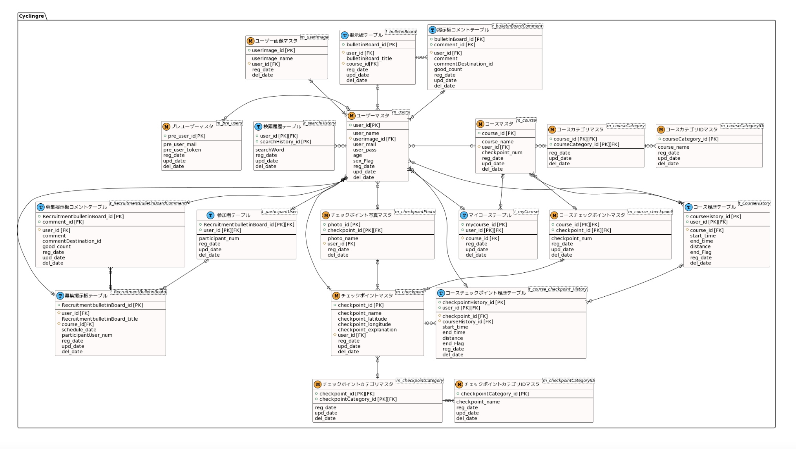

# DB定義書
## ER図
[ER図はこちら](https://github.com/AsoSD3A3/CyclingSystem/blob/main/DB/ER%E5%9B%B3.md)

*****

*****

# データベース設計図

## m_users

|和名|属性名(カラム名)|型|PK|NN|FK|
|---|-----|--|--|--|--|
|ユーザーID|user_id|int(8)|○|○||
|ユーザー名|user_name|varchar(20)||○||
|ユーザー画像ID|user_image_id|int(8)|||○|
|メールアドレス|user_mail|varchar(100)||○||
|パスワード|user_pass|varchar(20)||○||
|年代|age|int(3)||○||
|性別フラグ|sex_Flag|int(2)||○||
|登録日|reg_date|datetime||○||
|更新日|upd_date|datetime||||
|削除日|del_date|datetime||||

## m_pre_users

|和名|属性名(カラム名)|型|PK|NN|FK|
|---|-----|--|--|--|--|
|ユーザーID|pre_user_id|int(8)|○|○||
|ユーザー名|pre_user_name|varchar(20)||○||
|メールアドレス|pre_user_mail|varchar(100)||○||
|パスワード|pre_user_pass|varchar(255)||○||
|年代|pre_age|int(3)||○||
|性別フラグ|pre_sex_flag|int(2)||○||
|トークン|pre_user_token|varchar(255)||○||
|登録日|reg_date|datetime||○||
|更新日|upd_date|datetime||||
|削除日|del_date|datetime||||
|フラグ|flag|int(1)||○||
|変更先ユーザーID|change_user_id|int(8)||||

## m_course

|和名|属性名(カラム名)|型|PK|NN|FK|
|---|-----|--|--|--|--|
|コースID|course_id|int(8)|○|○||
|コース名|course_name|varchar(100)||○||
|コース説明|course_explanation|varchar(200)||||
|ユーザー(作成者)ID|user_id|int(8)||○|○|
|チェックポイント数|checkpoint_num|int(8)||○||
|登録日|reg_date|datetime||○||
|更新日|upd_date|datetime||||
|削除日|del_date|datetime||||

## m_courseCategory

|和名|属性名(カラム名)|型|PK|NN|FK|
|---|-----|--|--|--|--|
|コースID|course_id|int(8)|○|○||
|コースカテゴリID|courseCategory_id|int(8)|○|○||
|登録日|reg_date|datetime||○||
|更新日|upd_date|datetime||||
|削除日|del_date|datetime||||

## m_courseCategoryID

|和名|属性名(カラム名)|型|PK|NN|FK|
|---|-----|--|--|--|--|
|コースカテゴリID|courseCategory_id|int(8)|○|○||
|コースカテゴリー名|courseCategory_name|varchar(100)||○||
|登録日|reg_date|datetime||○||
|更新日|upd_date|datetime||||
|削除日|del_date|datetime||||

## m_checkpoint

|和名|属性名(カラム名)|型|PK|NN|FK|
|---|-----|--|--|--|--|
|チェックポイントID|checkpoint_id|int(8)|○|○||
|チェックポイント名|checkpoint_name|varchar(100)||○||
|チェックポイント緯度|checkpoint_latitude|decimal(9,6)||○||
|チェックポイント経度|checkpoint_longitude|decimal(9,6)||○||
|チェックポイント説明説明|checkpoint_explanation|varchar(1000)||||
|ユーザー(作成者)ID|user_id|int(8)||○|○|
|登録日|reg_date|datetime||○||
|更新日|upd_date|datetime||||
|削除日|del_date|datetime||||

## m_checkpointCategory

|和名|属性名(カラム名)|型|PK|NN|FK|
|---|-----|--|--|--|--|
|チェックポイントID|checkpoint_id|int(8)|○|○||
|チェックポイントカテゴリID|checkpointCategory_id|int(8)|○|○||
|登録日|reg_date|datetime||○||
|更新日|upd_date|datetime||||
|削除日|del_date|datetime||||

## m_checkpointCategoryID

|和名|属性名(カラム名)|型|PK|NN|FK|
|---|-----|--|--|--|--|
|チェックポイントカテゴリID|checkpointCategory_id|int(8)|○|○||
|チェックポイントカテゴリー名|checkpointCategory_name|varchar(100)||○||
|登録日|reg_date|datetime||○||
|更新日|upd_date|datetime||||
|削除日|del_date|datetime||||

## m_course_checkpoint

|和名|属性名(カラム名)|型|PK|NN|FK|
|---|-----|--|--|--|--|
|コースID|course_id|int(8)|○|○|○|
|チェックポイントID|checkpoint_id|int(8)|○|○|○|
|チェックポイントナンバー(コース中の何番目のチェックポイントかを記録する)|checkpoint_num|int(8)||○||
|登録日|reg_date|datetime||○||
|更新日|upd_date|datetime||||
|削除日|del_date|datetime||||

## t_CourseHistory

|和名|属性名(カラム名)|型|PK|NN|FK|
|---|-----|--|--|--|--|
|コース履歴ID|courseHistory_id|int(8)|○|○||
|ユーザーID|user_id|int(8)|○|○|○|
|コースID|course_id|int(8)||○|○|
|開始時間|start_time|datetime||○||
|終了時間|end_time|datetime||||
|距離|distance|int(255)||○||
|完了フラグ|end_Flag|int(1)||○||
|登録日|reg_date|datetime||○||
|削除日|del_date|datetime||||

## t_course_checkpoint_History

|和名|属性名(カラム名)|型|PK|NN|FK|
|---|-----|--|--|--|--|
|チェックポイント履歴ID|checkpointHistory_id|int(8)|○|○||
|ユーザーID|user_id|int(8)|○|○|○|
|チェックポイントID|checkpoint_id|int(8)||○|○|
|コース履歴ID|courseHistory_id|int(8)||○|○|
|開始時間|start_time|datetime||○||
|終了時間|end_time|datetime||○||
|距離|distance|int(255)||○||
|完了フラグ|end_Flag|int(1)||○||
|登録日|reg_date|datetime||○||
|削除日|del_date|datetime||||

## t_myCourse

|和名|属性名(カラム名)|型|PK|NN|FK|
|---|-----|--|--|--|--|
|マイコースID|mycourse_id|int(8)|○|○||
|ユーザーID|user_id|int(8)|○|○|○|
|コースID|course_id|int(8)||○|○|
|登録日|reg_date|datetime||○||
|更新日|upd_date|datetime||||
|削除日|del_date|datetime||||

## t_bulletinBoard

|和名|属性名(カラム名)|型|PK|NN|FK|
|---|-----|--|--|--|--|
|掲示板ID|bulletinBoard_id|int(8)|○|○||
|ユーザーID|user_id|int(8)||○|○|
|掲示板タイトル|bulletinBoard_title|varchar(50)||○||
|コースID|course_id|int(8)||○|○|
|登録日|reg_date|datetime||○||
|更新日|upd_date|datetime||||
|削除日|del_date|datetime||||

## t_bulletinBoardComment

|和名|属性名(カラム名)|型|PK|NN|FK|
|---|-----|--|--|--|--|
|掲示板ID|bulletinBoard_id|int(8)|○|○|○|
|コメントID|comment_id|int(8)|○|○|○|
|ユーザーID|user_id|int(8)||○|○|
|コメント|comment|varchar(200)||○||
|コメント先ID|commentDestination_id|int(8)||||
|いいね(参考になった)|good_count|int(8)||○||
|登録日|reg_date|datetime||○||
|更新日|upd_date|datetime||||
|削除日|del_date|datetime||||

## t_RecruitmentBulletinBoard

|和名|属性名(カラム名)|型|PK|NN|FK|
|---|-----|--|--|--|--|
|募集掲示板ID|RecruitmentbulletinBoard_id|int(8)|○|○||
|ユーザーID|user_id|int(8)||○|○|
|募集掲示板タイトル|RecruitmentbulletinBoard_title|varchar(50)||○||
|コースID|course_id|int(8)||○|○|
|サイクリング予定日|schedule_date|datetime|||○||
|参加者数|participantUser_num|int(2)||○||
|登録日|reg_date|datetime||○||
|更新日|upd_date|datetime||||
|削除日|del_date|datetime||||

## t_RecruitmentBulletinBoardComment

|和名|属性名(カラム名)|型|PK|NN|FK|
|---|-----|--|--|--|--|
|掲示板ID|RecruitmentbulletinBoard_id|int(8)|○|○|○|
|コメントID|comment_id|int(8)|○|○|○|
|募集掲示板説明|RecruitmentbulletinBoard_explanation|varchar(200)||||
|ユーザーID|user_id|int(8)||○|○|
|コメント|comment|varchar(200)||○||
|コメント先ID|commentDestination_id|int(8)||||
|いいね(参考になった)|good_count|int(8)||○||
|登録日|reg_date|datetime|||○||
|更新日|upd_date|datetime|||||
|削除日|del_date|datetime|||||

## t_participantUser

|和名|属性名(カラム名)|型|PK|NN|FK|
|---|-----|--|--|--|--|
|募集掲示板ID|RecruitmentbulletinBoard_id|int(8)|○|○|○|
|ユーザーID|user_id|int(8)|○|○|○|
|参加順番|participant_num|int(2)||○||
|登録日|reg_date|datetime||○||
|更新日|upd_date|datetime||||
|削除日|del_date|datetime||||

## t_searchHistory

|和名|属性名(カラム名)|型|PK|NN|FK|
|---|-----|--|--|--|--|
|検索履歴ID|searchHistory_id|int(8)|○|○||
|ユーザーID|user_id|int(8)|○|○|○|
|検索ワード|searchWord|varchar(200)||○||
|登録日|reg_date|datetime||○||
|削除日|del_date|datetime||||

## t_checkpointPhoto
|和名|属性名(カラム名)|型|PK|NN|FK|
|---|-----|--|--|--|--|
|写真ID|Photo_id|int(8)|○|○||
|チェックポイントID|checkpoint_id|int(8)|○|○|○|
|写真名(画像ファイル名)|Photo_name|varchar(200)||○||
|ユーザーID|user_id|int(8)||○|○|
|登録日|reg_date|datetime||○||
|削除日|del_date|datetime||||

## m_userImage
|和名|属性名(カラム名)|型|PK|NN|FK|
|---|-----|--|--|--|--|
|ユーザー画像ID|userimage_id|int(8)|○|○||
|ユーザーID|user_id|int(8)|○|○|○|
|画像ファイル名|userimage_name|varchar(200)||○||
|登録日|reg_date|datetime||○||
|削除日|del_date|datetime||||
