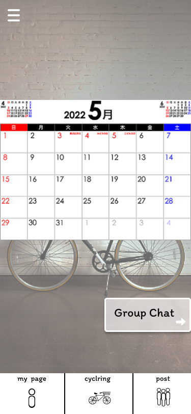

### 画面詳細図
## カレンダー
### プロトタイプは以下のリンク先
[プロトタイプ](https://www.figma.com/file/YLXi0XXJfyq6239uKAU8LF/cyclinger?node-id=103%3A548)
*****

|ID|要素|内容|アクション|イベント|対応DB|
|--|----|----|---------|--------|------|
|1|ハンバーガーメニュー|ボタン|クリック|他ページへのアクセス|-|
|2|カレンダー|-|-|カレンダーの表示|-|
|3|Group Chat|ボタン|クリック|グループチャットページに遷移|-|
