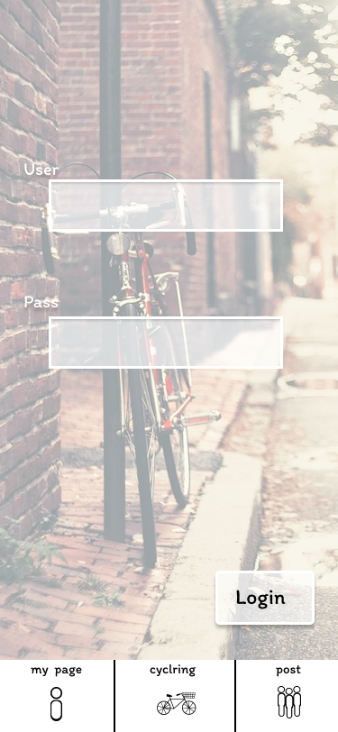

### 画面詳細図
## ログイン
### プロトタイプは以下のリンク先
[プロトタイプ](https://www.figma.com/file/YLXi0XXJfyq6239uKAU8LF/cyclinger?node-id=103%3A548)
*****

*****

補足：対応DBの列はDB設計後、〇を対応するテーブル・カラム名に差し替えること。
| ID | 要素 | 内容 | アクション | イベント | 対応DB |
|----|-----|------|------------|-----------|-------|
|1   |ID|入力欄|テキスト入力|-       |〇|
|2   |PASS|入力欄|テキスト入力|-       |〇|
|3   |ログインボタン|ボタン|クリック|ログイン処理実行|-       |
