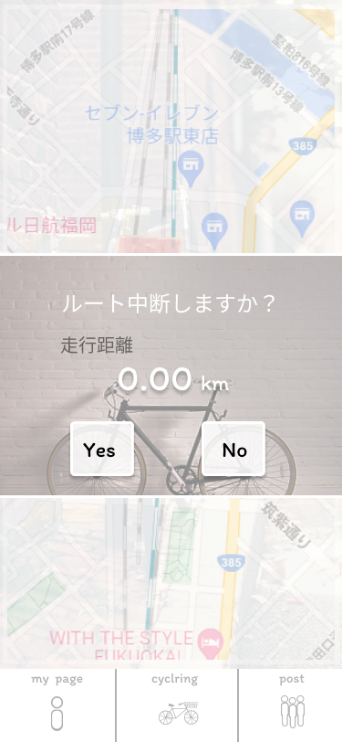

### 画面詳細図
### ログアウト
[プロトタイプ](https://www.figma.com/file/YLXi0XXJfyq6239uKAU8LF/cyclinger?node-id=0%3A1)
*****

|ID|要素|内容|アクション|イベント|対応DB|
|--|----|----|---------|--------|------|
|1|Yes|ボタン|クリック|ログアウト処理実行ページに遷移||
|2|No|ボタン|クリック|1つ前のページに遷移|○|
