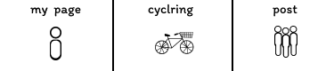

### 画面詳細図
## メインメニュー
### プロトタイプは以下のリンク先
[プロトタイプ](https://www.figma.com/file/YLXi0XXJfyq6239uKAU8LF/cyclinger?node-id=103%3A548)
*****

|ID|要素|内容|アクション|イベント|対応DB|
|--|----|----|---------|--------|------|
|1|My Page|テキストボタン|クリック|My Pageページに遷移|-|
|2|cycling|テキストボタン|クリック|cyclingページに遷移|-|
|3|postルート|テキストボタン|クリック|postページに遷移|-|
