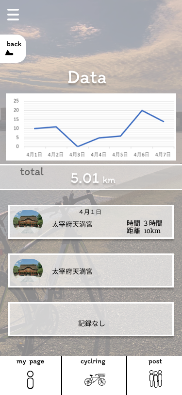

### 画面詳細図
## マイデータ
### プロトタイプは以下のリンク先
[プロトタイプ](https://www.figma.com/file/YLXi0XXJfyq6239uKAU8LF/cyclinger?node-id=103%3A548)
*****

|ID|要素|内容|アクション|イベント|対応DB|
|--|----|----|---------|--------|------|
|1|ハンバーガーメニュー|ボタン|クリック|他ページへのアクセス|-|
|2|back|ボタン|クリック|1つ前のページに遷移|-|
|3|グラフ|-|-|グラフの表示|〇|
|4|Total|-|-|トータルの表示|〇|
|5|ルート履歴|テキストボタン|クリック|-|-|
