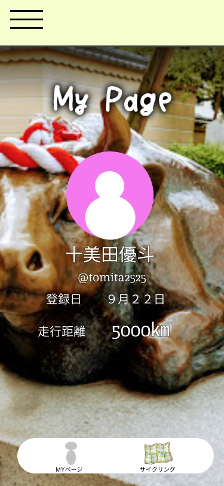

### 画面詳細図
### マイページ
[プロトタイプ](https://www.figma.com/file/YLXi0XXJfyq6239uKAU8LF/cyclinger?node-id=0%3A1)
*****

|ID|要素|内容|アクション|イベント|対応DB|
|--|----|----|---------|--------|------|
|1|ハンバーガーメニュー|他ページへのアクセス|ボタン|-|-|
|2|ユーザーネーム|-|-|-|〇|
|3|ID|-|-|-|〇|
|4|Total|-|-|-|〇|
|5|My favorite route|他ページへのアクセス|ボタン|My favorite routeページに遷移|-|
|6|My date|他ページへのアクセス|ボタン|My dateページに遷移|-|
|7|Create route|他ページへのアクセス|ボタン|Create routeページに遷移|-|
