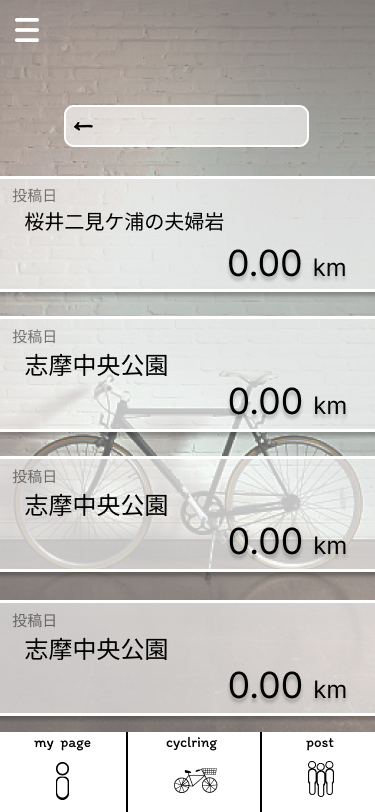
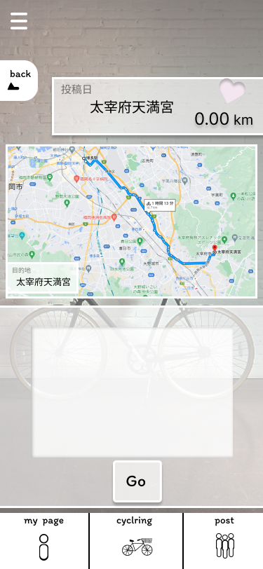

### 画面詳細図
## 投稿
### プロトタイプは以下のリンク先
[プロトタイプ](https://www.figma.com/file/YLXi0XXJfyq6239uKAU8LF/cyclinger?node-id=103%3A548)
*****

|ID|要素|内容|アクション|イベント|対応DB|
|--|----|----|---------|--------|------|
|1|ハンバーガーメニュー|ボタン|クリック|他ページへのアクセス|-|
|2|検索|入力欄|テキスト入力||〇|
|3|投稿されたルート|テキストボタン|クリック|-|〇|

|ID|要素|内容|アクション|イベント|対応DB|
|--|----|----|---------|--------|------|
|1|タイトル|入力欄|テキスト入力|-|〇|
|2|back|ボタン|クリック|1つ前のページに遷移|-|
|3|お気に入りボタン|ボタン|クリック|お気に入りルートに追加|-|
|4|マップ|-|-|マップの表示|〇|
|5|メッセージ|入力欄|テキスト入力|-|〇|
|6|Go|ボタン|クリック|開始ページに遷移|-|
