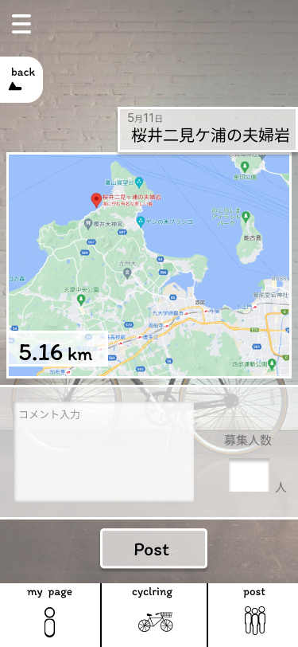

### 画面詳細図
### 募集追加
[プロトタイプ](https://www.figma.com/file/YLXi0XXJfyq6239uKAU8LF/cyclinger?node-id=103%3A548)
*****

|ID|要素|内容|アクション|イベント|対応DB|
|--|----|----|---------|--------|------|
|1|ハンバーガーメニュー|ボタン|クリック|他ページへのアクセス|-|
|2|back|ボタン|クリック|前のページへ戻る|-|
|3|目的地表示|テキスト表示|-|目的地の表示|-|
|4|MAP|MAP表示|-|MAP表示|-|
|5|距離|テキスト表示|-|距離表示|-|
|6|コメント|テキスト入力|入力|テキスト入力|〇|
|7|募集人数|テキスト入力|入力（数字）|テキスト入力|〇|
|8|Post|ボタン|クリック|募集一覧へデータを送る|〇|
|9|メインメニュー|ボタン|クリック|各ページへ移行|-|
