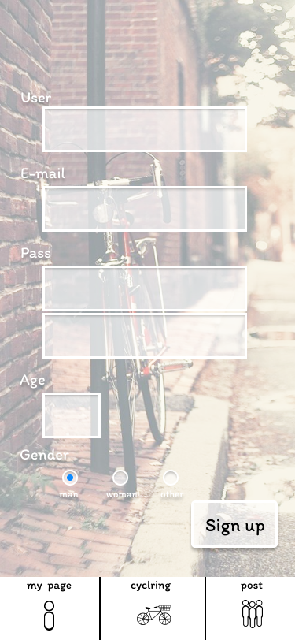

### 画面詳細図
## アカウント作成
### プロトタイプは以下のリンク先
[プロトタイプ](https://www.figma.com/file/YLXi0XXJfyq6239uKAU8LF/cyclinger?node-id=103%3A548)
*****

*****

補足：対応DBの列はDB設計後、〇を対応するテーブル・カラム名に差し替えること。
| ID | 要素 | 内容 | アクション | イベント | 対応DB |
|----|-----|------|------------|-----------|-------|
|1|ユーザーネーム|入力欄|テキスト入力|-       |〇|
|2|メールアドレス|入力欄|テキスト入力|-       |〇|
|3|PASS|入力欄|テキスト入力|-       |〇|
|4|PASS確認|入力欄|テキスト入力|-       |〇|
|5|年齢|入力欄|テキスト入力|-       |〇|
|6|性別|選択欄|ラジオボタン|-       |〇|
|7|確認|ボタン|クリック|メール送信、I sent an email.ページに遷移|〇|
