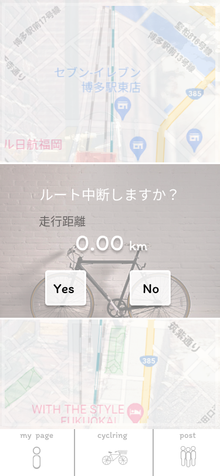

### 画面詳細図
### 中断
[プロトタイプ](https://www.figma.com/file/YLXi0XXJfyq6239uKAU8LF/cyclinger?node-id=0%3A1)
*****

|ID|要素|内容|アクション|イベント|対応DB|
|--|----|----|---------|--------|------|
|1|Yes|ボタン|クリック|cyclringページに遷移||
|2|No|ボタン|クリック|cyclingerページに遷移|○|
|3|走行距離|||走行距離を表示|○|
