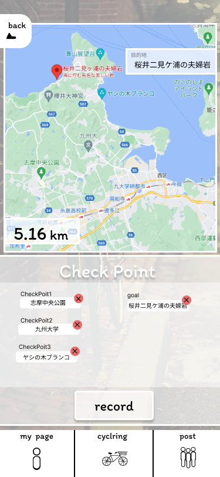

### 画面詳細図
### チェックポイント
[プロトタイプ](https://www.figma.com/file/YLXi0XXJfyq6239uKAU8LF/cyclinger?node-id=0%3A1)
*****

|ID|要素|内容|アクション|イベント|対応DB|
|--|----|----|---------|--------|------|
|1|record|ボタン|クリック|ルートの保存|○|
|2|メインメニュー|メインページ切り替え|ボタン|||
|3|戻るボタン|ボタン|クリック|||
|4|マップ|チェックポイントをタップで選出|拡大縮小&選出||○|
