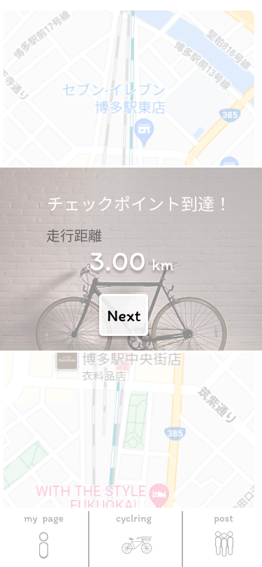

### 画面詳細図
### チェックポイント到達時1
[プロトタイプ](https://www.figma.com/file/YLXi0XXJfyq6239uKAU8LF/cyclinger?node-id=0%3A1)
*****

|ID|要素|内容|アクション|イベント|対応DB|
|--|----|----|---------|--------|------|
|1|Next|ボタン|クリック|cyclringerページに遷移|○|
|2|走行距離|||走行距離を表示|○|
