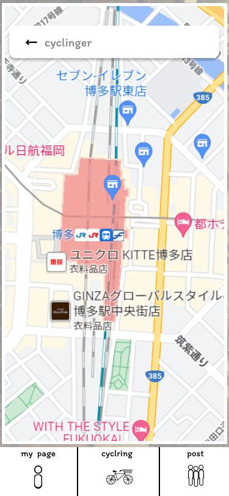

### 画面詳細図
### プロトタイプは以下のリンク先
[プロトタイプ](https://www.figma.com/file/YLXi0XXJfyq6239uKAU8LF/cyclinger?node-id=0%3A1)
*****

|ID|要素|内容|アクション|イベント|対応DB|
|--|----|----|---------|--------|------|
|1|検索|入力欄|テキスト入力|-|〇|
|2|戻るボタン|画面を戻す|ボタン|||
|3|マップ|タップしたところにピンをたて目的地を表示|拡大縮小&ピン||○|
|4|My Page|他ページへのアクセス|ボタン|My Pageページに遷移|-|
|5|他人ルート|他ページへのアクセス|ボタン|他人ルートページに遷移|-|
|6|サイクリング|他ページへのアクセス|ボタン|サイクリングページに遷移|-|
