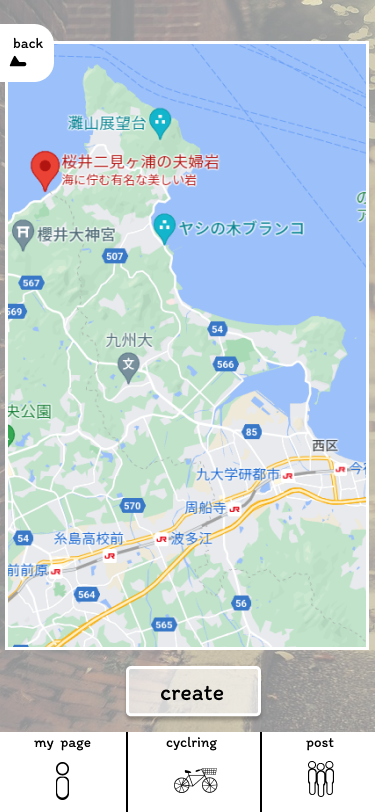

### 画面詳細図
### マップ(目的地1)
[プロトタイプ](https://www.figma.com/file/YLXi0XXJfyq6239uKAU8LF/cyclinger?node-id=0%3A1)
*****

|ID|要素|内容|アクション|イベント|対応DB|
|--|----|----|---------|--------|------|
|1|確定ボタン|ボタン|クリック|ルートの表示||
|2|メインメニュー|メインページ切り替え|ボタン|||
|3|戻るボタン|画面を戻す|ボタン|||
|4|マップ|タップしたところにピンをたて目的地を表示|拡大縮小&ピン|||
||My Page|他ページへのアクセス|ボタン|My Pageページに遷移|-|
||他人ルート|他ページへのアクセス|ボタン|他人ルートページに遷移|-|
||サイクリング|他ページへのアクセス|ボタン|サイクリングページに遷移|-|
