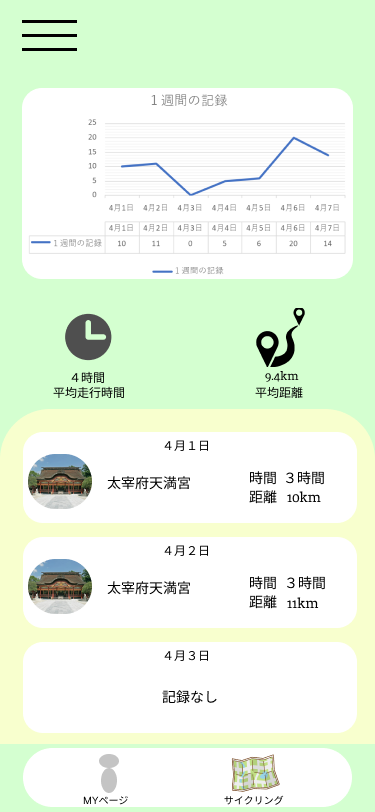

### 画面詳細図
## 履歴
### プロトタイプは以下のリンク先
[プロトタイプ](https://www.figma.com/file/YLXi0XXJfyq6239uKAU8LF/cyclinger?node-id=0%3A1)
*****

|ID|要素|内容|アクション|イベント|対応DB|
|--|----|----|---------|--------|------|
|1|ハンバーガーメニュー|ボタン|クリック|ハンバーガーメニューの展開||
|2|グラフ||グラフの表示|グラフの表示|〇|
|3|平均走行時間|||平均走行時間の表示|〇|
|4|走行距離|||走行距離の表示|〇|
|5|履歴|テキストボタン|クリック|過去のルートの表示|〇|
