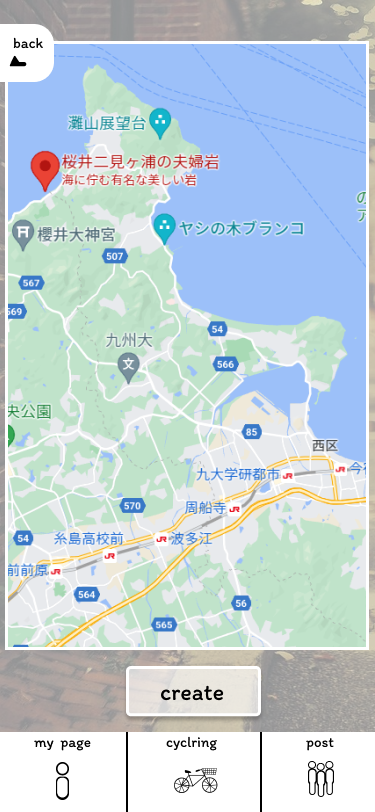

### 画面詳細図
### 検索結果
[プロトタイプ](https://www.figma.com/file/YLXi0XXJfyq6239uKAU8LF/cyclinger?node-id=0%3A1)
*****

|ID|要素|内容|アクション|イベント|対応DB|
|--|----|----|---------|--------|------|
|1|確定ボタン|ボタン|クリック|ルートの作成ページに遷移|○|
|2|戻るボタン|ボタン|クリック|画面をマップに戻す||
|3|マップ|タップしたところにピンをたて目的地を表示|拡大縮小&ピン||○|
