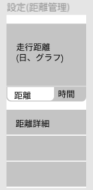

### 画面詳細図
### プロトタイプは以下のリンク先
[プロトタイプ](https://www.figma.com/file/YLXi0XXJfyq6239uKAU8LF/cyclinger?node-id=0%3A1)
*****

|ID|要素|内容|アクション|イベント|対応DB|
|--|----|----|---------|--------|------|
|1|距離|ボタン|クリック|日別グラフの表示|-|
|2|時間|ボタン|クリック|日別グラフの表示|-|
|3|距離詳細|ボタン|クリック|ルートの表示|-|
|4||||||
|5||||||
|6||||||
